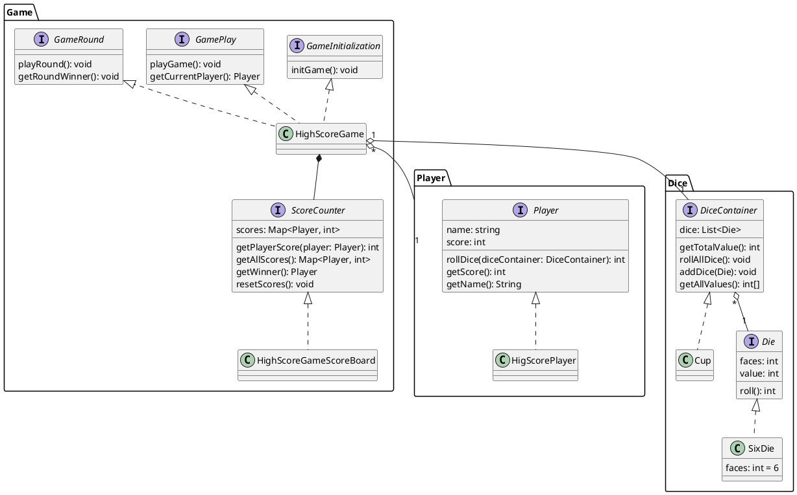

# Dice Game - Gherkin

Le concept :

- Le formateur jour le rôle d'un client avec une demande spécifique
- Les apprenants sont séparés en deux équipes.
- Le jeu commence par une réunion globale qui va étudier le besoin du client
- Puis chaque équipe devra trancrire les US en Gherkin

## Etapes

### Etape 1 : Echange avec le client

Le projet :

Jean-Michel souhaite développer une application en ligne qui permet de jouer aux dés avec ses amis. Il a déjà fait appel à un autre prestataire par le passé, mais n'était pas satisfait par le travail fourni. En effet, si la première livraison s'est bien passée, la seconde a rendu l'application non fonctionnelle. Il a refusé de payer la seconde livraison et le prestataire est parti avec le code avant de faire faillite. Jean-Michel a donc décidé de faire appel à vous pour réaliser cette application et a pu sauver quelques pièces produites : un diagramme UML, une liste d'user stories et quelques tests d'acceptation en gherkin.

Dans l'ensemble voici le déroulement du jeu :

- Il y a un gobelet par partie
- On met autant de dés dans le gobelet que de joueurs
- Il y a autant de manches que de joueur + 1
- Lors d'une manche, chaque joueur lance les dés
- Le joueur avec le plus haut score gagne la manche
- Le joueur avec le plus de manches gagnées gagne la partie

À terme, il y aura une autre demande qui concerne le Yahtzee, mais pour l'instant, on se concentre sur le jeu de base !

Les équipes doivent donc commencer par échanger avec le client pour comprendre le besoin.

#### Les éléments récupérés

Les éléments sont toutes "parfaitement imparfaits" et il y a quelques coquilles un peu partout : signe que la communication avec le client n'a pas été parfaite au démarrage.

> Utilisez ces éléments pour appuyer le fait qu'on a parfois l'impression de faire de la BDD alors que dans les faits... on ne fait pas de BDD.

- les des éléments :
  - Règles du jeu (dans ce fichier, ci-dessus ↑ )
  - Diagramme UML (dans ce fixier ci-dessous ↓ )
  - US (fichier à part `DiceGame_US.md`)

##### Diagramme UML

Le diagramme produit par le prestataire précédent est le suivant :

#### Pour le formateur

Il est important de ne **jamais** soulever certains points qui seront "évidents" pour le client comme :

- QUID des égalités sur une manche ? → Il y a relance entre les deux joueurs qui ont le même score
- Chaque joueur lance SON dé ou c'est tous les dés ? → Chaque joueur lance TOUS les dés
- Dés à 6 faces ? → Pas forcément. Des fois, on joue avec des dés différents.
  - Possibilité de mélanger les types de dés ? → Oui, chacun rapporte un dé qu'il mettra dans le gobelet.
    - Mais pour la première itération, on va se concentrer sur les dés à 6 faces
- Du coup, c'est un gobelet pour toute la partie ? → Oui
  - Mais des fois, on n'a pas de gobelet et on lance dans un plateau.
- Qui comptabilise les scores ? → On garde une feuille pour compter les scores
  - On y note le score de chaque manche ou juste le nombre de manches gagnées ? → Le nombre de manches gagnées

#### Pour les équipes

- L'étude du besoin se fait avec tout le monde
- Ils seront ensuite répartis pour formaliser leurs notes, idéalement en gherkin
  - Il n'est pas nécessaire ou obligatoire d'implémenter Cucumber, sauf si vous avez envie de le faire
